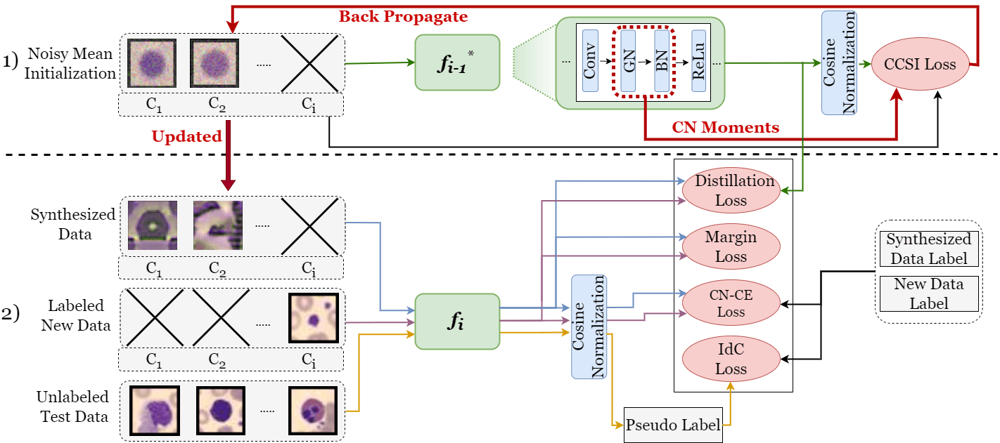

# CCSI

This is the PyTorch implemention of our paper **"CCSI: Continual Class-Specific Impression for Data-free Class
Incremental Learning"** submitted to TMI, as an extention work of [**"Class Impression for Data-Free Incremental
Learning"**](https://link.springer.com/chapter/10.1007/978-3-031-16440-8_31) accpeted by MICCAI 2022
by [Sana Ayromlou](https://github.com/sanaAyrml), Tresa Tsang, Prang Abolmaesumi
,and [Xiaoxiao Li](https://xxlya.github.io/xiaoxiao/)

## Abstract

> Our contributions are summarised as:
> - We propose **CCSI** to generate prototypical synthetic images with high quality for each class by 1) initializing
    the synthesis process with the mean image of each class, and 2) regularizing pixel-wise optimization loss of image
    synthesis using moments of normalization layers.
> - We leverage CN in our pipeline and design a novel image synthesis method with class-adaptive CN statistics to 1)
    improve the quality and class-specificity of **CCSI**, and 2) reduce overwriting the moments of normalization layer
    for samples of newly introduced classes to alleviate catastrophic forgetting of previous classes.
> - We introduce several novel losses to mitigate domain shift between synthesized images and original images, handle
    class imbalance issues and encourage robust decision boundaries for handling catastrophic forgetting.


Two main steps of **CCSI** contain: 1) Continual class-specific data synthesis: Initialize a batch of images with the
mean of each class to synthesize images using a frozen model trained on the previous task. Update the batch by
back-propagating and using the moments saved in the CN as a regularization term; 2) Model update on new tasks: Leverage
information from the previous model using the distillation loss. Overcome data imbalance and prevent catastrophic
forgetting of past tasks with the cosine normalized cross-entropy (CN-CE) loss and margin loss. Mitigate domain shift
between synthesized and original data with a novel intra-domain conservative (IdC) loss, a semi-supervised domain
adaptation technique.

## Sections

The main folder contains the code implemented for the MedMNIST dataset. You can get access to MedMNIST dataset
via [Zendo](https://doi.org/10.5281/zenodo.6496656). You could also use our code to download automatically by
setting `download_data=True` in Config.

### Dataloader

### Model

### Wandb

### Config

### Training Scheme

### Synthesis Scheme

### Visualization

## Main Results

## Acknowledgement

The code is includes borrowed implementations from (https://github.com/hshustc/CVPR19_Incremental_Learning)
and (https://github.com/NVlabs/DeepInversion). Thanks for their great works.

## Citing

```
Will be added
```

## Contact

For questions and suggestions, please contact Sana Ayromlou via ayromlous@gmail.com.
